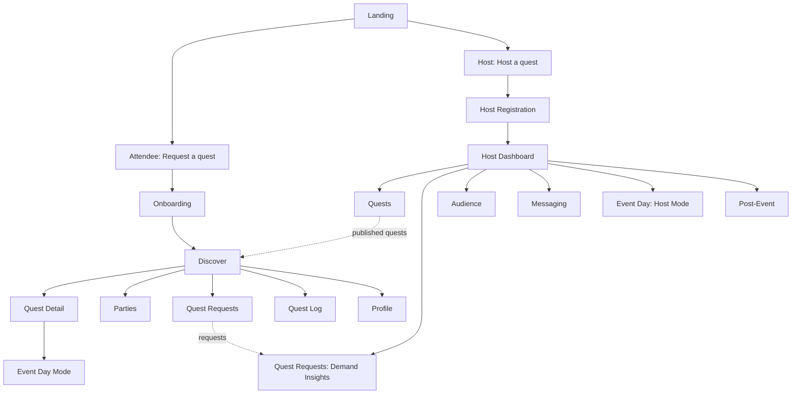
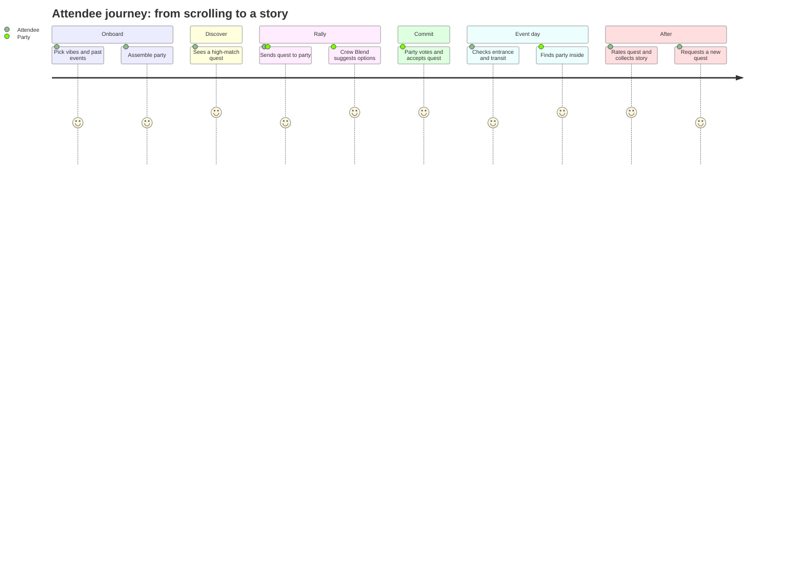
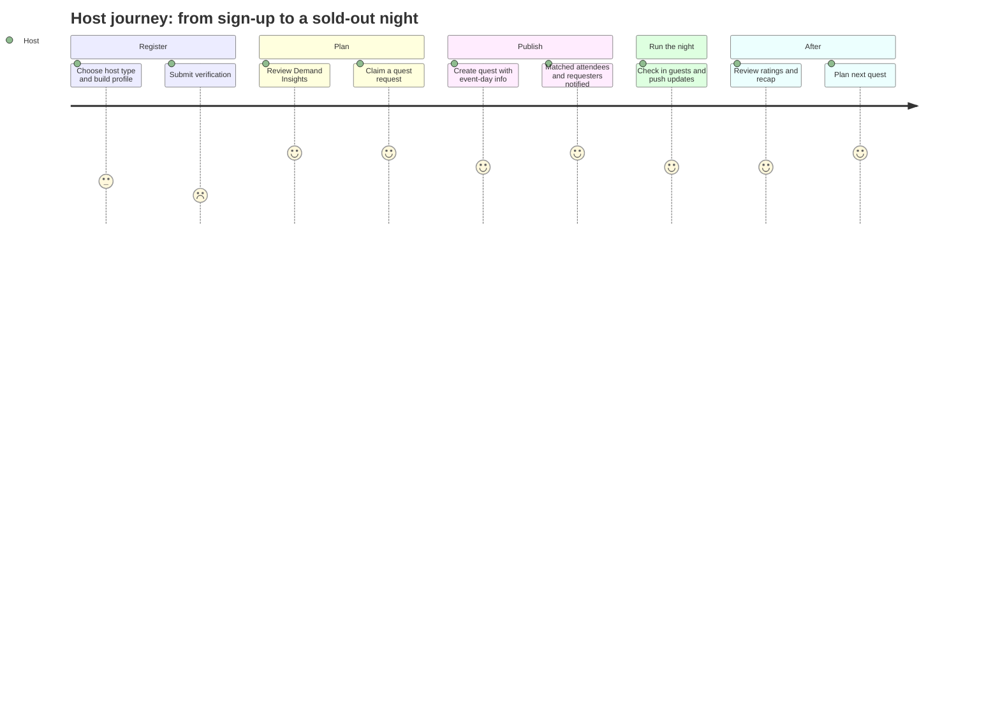
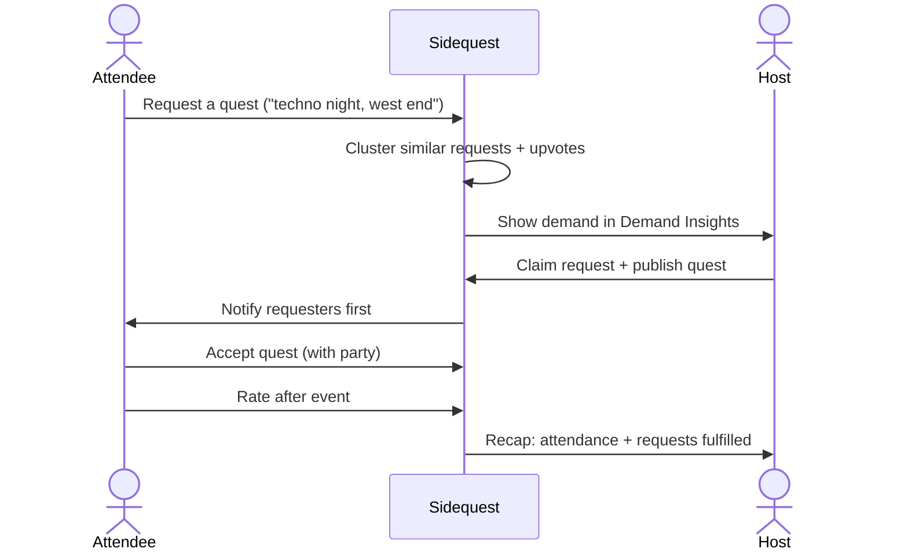

# Sidequest — Product Spec

> **Collect the stories, not just the tickets.**
> Primary CTA: **Request a quest**

Sidequest is an event discovery app that matches people and their crews to events they'll love, and lets them tell hosts what they want to see next. Positioning: *the Spotify for local events.* Launching in Toronto, built to scale to any city.

_Last updated: September 2026 · Status: concept / draft_

---

## Table of Contents

1. [Overview](#1-overview)
2. [Glossary](#2-glossary)
3. [Site Map](#3-site-map)
4. [Feature List](#4-feature-list)
5. [User Journeys](#5-user-journeys)
6. [Open Questions](#6-open-questions)

---

## 1. Overview

**Problem:** Event info is scattered across too many hubs. General tools (Google) are too broad, niche tools (EDMtrain) are too narrow, and nothing plans around your friends.

**User groups**

| Group | Who | Core need |
|---|---|---|
| Attendees | Solo explorers and crews | Find events that fit their taste and get the group to actually go |
| Hosts | Venues, promoters, artists/collectives, community groups, brands | Know what people want and fill the room |

**Differentiators**

- **Crew Blend** — merges the tastes of everyone in a party into shared recommendations.
- **Demand Signals (Quest Requests)** — attendees request the events they want; hosts see aggregated demand and act on it.

**Competitors / references:** Motivez, Fever, DICE, Eventbrite · Inspiration: Radiate, Wander

---

## 2. Glossary

Sidequest uses light gaming language in the UI.

| Sidequest term | Plain meaning |
|---|---|
| Quest | An event |
| Accept quest | RSVP / commit to going |
| Party | A crew / friend group |
| Assemble your party | Connect contacts / create a crew |
| Quest Request | Demand Signal |
| Quest Log | My Plans (upcoming, saved, past) |
| Quest complete | Event attended and rated |
| Collected stories | Past events on your profile |
| Taste avatar | The AI profile that learns your preferences |

---

## 3. Site Map

### High-level structure



### Full site map

```
Sidequest
├── Landing
│   ├── "Collect the stories, not just the tickets."
│   ├── [ Request a quest ]  → Attendee onboarding
│   └── [ Host a quest ]     → Host registration
│
├── ATTENDEE
│   ├── Onboarding
│   │   ├── "What kind of quests are you after?" (interests & vibes)
│   │   ├── Add past events (seeds the taste avatar)
│   │   ├── Assemble your party (connect contacts)
│   │   └── Neighbourhood + transit preferences
│   │
│   ├── Discover (Home)
│   │   ├── For You feed (taste avatar picks)
│   │   ├── Tonight / This Weekend
│   │   ├── Browse by vibe & category
│   │   ├── Map view (quests around your location)
│   │   │   ├── Pins with match score + friends going
│   │   │   └── Filters: distance, who's going (friends / party),
│   │   │                interest (my vibes / Crew Blend / a vibe), when, price
│   │   └── Search + filters (price, distance, date, indoor/outdoor)
│   │
│   ├── Quest Detail (event page)
│   │   ├── Info, venue, price, host profile
│   │   ├── Match score ("why this is for you")
│   │   ├── Friends & parties going
│   │   └── Accept quest · Send to party · Get tickets · Follow host
│   │
│   ├── Parties (crews)
│   │   ├── My parties
│   │   ├── Crew Blend (shared taste + blended recs)
│   │   ├── Group plan (polls: which quest, when, meet-up spot)
│   │   └── Party chat
│   │
│   ├── Quest Requests (Demand Signals)
│   │   ├── Request a quest ("I'd go to a ___ in ___")
│   │   ├── Trending requests (upvote / join)
│   │   └── My requests + status (claimed by a host?)
│   │
│   ├── Quest Log (My Plans)
│   │   ├── Upcoming
│   │   ├── Saved
│   │   └── Completed (rate → trains avatar, adds to collected stories)
│   │
│   ├── Event Day Mode
│   │   ├── Venue map + entrances
│   │   ├── Live host updates
│   │   ├── Attendee group chat
│   │   ├── Transit there + home
│   │   └── Find my party
│   │
│   └── Profile
│       ├── Taste avatar (view + edit what it's learned)
│       ├── Collected stories (past quests)
│       ├── Followed hosts
│       ├── Switch to host profile
│       └── Settings & privacy (contact visibility, location)
│
└── HOST
    ├── Registration
    │   ├── Host type: Venue · Promoter/Organizer · Artist/Collective
    │   │              · Community group · Brand
    │   ├── Account basics
    │   ├── Host profile (logo, bio, genres/vibes, neighbourhoods, socials)
    │   ├── Verification (business/org info, website/socials,
    │   │                 past event links, venue address + capacity)
    │   ├── Ticketing setup (link external: Eventbrite, DICE, own site)
    │   ├── Invite team + roles (Owner, Editor, Door staff)
    │   └── Review pending → Approved → Dashboard
    │
    ├── Dashboard
    │   ├── Upcoming quests at a glance
    │   ├── Performance snapshot (saves, RSVPs, party bookings)
    │   └── New requests matching your vibe + area
    │
    ├── Quests (event management)
    │   ├── Create a quest
    │   │   ├── Details (title, date, lineup, price, age, vibe tags)
    │   │   ├── Media (poster, photos, video)
    │   │   ├── Ticket link or guest list
    │   │   ├── Event-day info (venue map, entrances, accessibility,
    │   │   │                   transit tips, coat check, re-entry)
    │   │   └── Publish now / Schedule / Save draft
    │   ├── Drafts · Live · Past
    │   └── Duplicate a past quest (recurring nights)
    │
    ├── Quest Requests (Demand Insights)
    │   ├── Browse by area, genre, date, party size
    │   ├── Demand heatmap
    │   ├── Claim a request ("We're on it") → requesters notified first
    │   └── Link a published quest to a request
    │
    ├── Audience
    │   ├── Followers
    │   ├── Taste segments (aggregated, anonymized)
    │   ├── Party vs. solo attendance
    │   └── Repeat attendees
    │
    ├── Messaging
    │   ├── Announcements to followers / ticket holders
    │   ├── Event-day live updates ("doors delayed 30 min")
    │   └── Moderate attendee group chat
    │
    ├── Event Day (Host Mode)
    │   ├── Guest list / check-in
    │   ├── Live headcount vs. capacity
    │   └── Push updates to attendees
    │
    ├── Post-Event
    │   ├── Ratings + feedback
    │   ├── Quest recap (attendance, match quality, requests fulfilled)
    │   └── Invite attendees to follow / next quest
    │
    └── Settings
        ├── Host profile + verification status
        ├── Team & roles
        ├── Ticketing integrations
        └── Payouts (later, if in-app ticketing is added)
```

---

## 4. Feature List

**Priority key:** `MVP` = needed for first release · `Diff` = key differentiator · `Later` = post-MVP

### Attendee features

| # | Area | Feature | Description | Priority |
|---|---|---|---|---|
| A1 | Onboarding | Vibe & interest picker | "What kind of quests are you after?" | MVP |
| A2 | Onboarding | Past event import | Seeds the taste avatar with events already attended | MVP |
| A3 | Onboarding | Contact sync | Assemble your party; see what friends are going to | MVP |
| A4 | Personalization | Taste avatar | AI profile learning from interests, past events, and contacts' events | MVP |
| A5 | Discovery | For You feed | Solo recommendations ranked by match | MVP |
| A6 | Discovery | Match score | Explains why a quest fits you | MVP |
| A7 | Discovery | Browse, map, search, filters | Vibe categories, map view, date/price/distance filters | MVP |
| A23 | Discovery | Map filters | Filter quests on the map by distance from you, friends or party going, interests, time, and price | MVP |
| A8 | Social | **Crew Blend** | Merges party members' tastes into shared recommendations | Diff |
| A9 | Social | Group plan polls | Vote on which quest, time, and meet-up spot | MVP |
| A10 | Social | Party chat | Chat within a party | MVP |
| A11 | Demand | **Quest Requests** | Post, upvote, and track requests for events you want | Diff |
| A12 | Demand | Request notifications | First notice when a host claims or fulfills your request | Diff |
| A13 | Plans | Quest Log | Upcoming, saved, and completed quests | MVP |
| A14 | Event day | Venue map + entrances | Host-provided venue info | MVP |
| A15 | Event day | Transit there + home | Route planning to and from the venue | MVP |
| A16 | Event day | Attendee group chat | Chat with others at the same quest | MVP |
| A17 | Event day | Find my party | See where your crew is | Later |
| A18 | Feedback | Rate a quest | Ratings retrain the taste avatar | MVP |
| A19 | Profile | Collected stories | Visual history of past quests | MVP |
| A20 | Profile | Follow hosts | Get updates from favourite hosts | MVP |
| A21 | Tickets | In-app ticket purchase | Buy without leaving the app | Later |
| A22 | Transit | Rideshare integration | Book a ride from Event Day Mode | Later |

### Host features

| # | Area | Feature | Description | Priority |
|---|---|---|---|---|
| H1 | Registration | Host type + profile | Venue, promoter, collective, community group, brand | MVP |
| H2 | Registration | Verification | Business/org info, socials, past events, venue details | MVP |
| H3 | Registration | External ticketing link | Connect Eventbrite, DICE, or own ticket site | MVP |
| H4 | Registration | Team roles | Owner, Editor, Door staff | Later |
| H5 | Events | Create / publish quest | Details, media, tickets, vibe tags, scheduling | MVP |
| H6 | Events | Event-day info setup | Venue map, entrances, accessibility, transit tips | MVP |
| H7 | Events | Duplicate quest | Quickly repeat recurring nights | Later |
| H8 | Demand | **Demand Insights** | Browse requests by area, genre, date, party size | Diff |
| H9 | Demand | Demand heatmap | Visual map of where demand clusters | Diff |
| H10 | Demand | Claim a request | Respond to demand; requesters notified first | Diff |
| H11 | Audience | Followers + taste segments | Aggregated, anonymized audience insights | MVP |
| H12 | Audience | Party vs. solo + repeat attendance | Understand who comes and who returns | Later |
| H13 | Messaging | Announcements + live updates | Message followers and ticket holders | MVP |
| H14 | Messaging | Chat moderation | Moderate attendee group chat | MVP |
| H15 | Event day | Guest list / check-in | Check guests in at the door | Later |
| H16 | Event day | Live headcount | Attendance vs. capacity | Later |
| H17 | Post-event | Ratings + recap | Feedback, attendance, requests fulfilled | MVP |
| H18 | Payments | Payouts | Only if in-app ticketing is added | Later |

---

## 5. User Journeys

### 5.1 Attendee journey (with a party)



| Stage | What they do | Touchpoint | Problem solved |
|---|---|---|---|
| 1. Onboard | Picks vibes, adds past events, connects friends | Onboarding | Cold-start recommendations feel generic |
| 2. Discover | Sees a Friday quest with a 92% match | For You feed | Info overload across hubs |
| 3. Rally | Sends it to their party; Crew Blend suggests two alternatives everyone likes | Parties | Group chats stall on "idk what do you guys want" |
| 4. Commit | Party votes and accepts the quest; everyone gets tickets | Group plan → ticket link | Plans fall through without a decision point |
| 5. Event day | Checks the entrance, plans transit, finds friends inside | Event Day Mode | Arriving lost, splitting up, getting home late |
| 6. Reflect | Rates the night; it becomes a collected story | Quest Log → Completed | Recommendations don't improve over time |
| 7. Request | Posts "more Filipino indie nights in the west end"; others upvote | Quest Requests | Nothing to go to that fits their niche |
| 8. Loop closes | A host claims the request; requesters are notified first | Push notification | Attendees feel unheard |

### 5.2 Host journey



| Stage | What they do | Touchpoint | Problem solved |
|---|---|---|---|
| 1. Register | Chooses host type, builds profile, submits verification | Host Registration | Keeps quality high for a curated platform |
| 2. Plan | Reviews requests matching their vibe and neighbourhood | Dashboard → Demand Insights | Hosts guess at what people want |
| 3. Claim | Claims a request cluster ("We're on it") | Quest Requests | No direct line to their audience's wants |
| 4. Publish | Creates the quest with tickets and event-day info | Quests → Create | Event-day info lives in scattered posts |
| 5. Fill | Quest is matched to fitting attendees and parties; requesters notified first | Discover feeds + notifications | Paid promotion reaches the wrong people |
| 6. Run | Checks guests in, tracks capacity, pushes live updates | Event Day (Host Mode) | Last-minute changes don't reach attendees |
| 7. Learn | Reviews ratings, recap, follower growth | Post-Event | No feedback loop after the night |

### 5.3 The Demand Signal loop



---

## 6. Open Questions

Items below are proposals for team discussion, not final decisions.

- [ ] **Ticketing:** Link out to Eventbrite/DICE for MVP, or build in-app ticketing (better data and smoother "Accept quest," but adds payments, refunds, payouts)?
- [ ] **North star metric:** Must cover solo attendees, parties, and hosts. Candidate: *events attended that matched a Crew Blend or fulfilled a Quest Request.*
- [ ] **Event Day Mode:** Separate mode that activates on event day, or a section of Quest Detail?
- [ ] **Host verification:** Manual review, automated checks, or tiered (verified badge optional)?
- [ ] **Privacy:** What friends can see (attendance, requests, location in "Find my party").
- [ ] **Launch CTA test:** "Request a quest" vs. "Start your quest" on the landing page.
- [ ] **Scope for MVP:** Confirm which `Later` items stay out of the first release.
