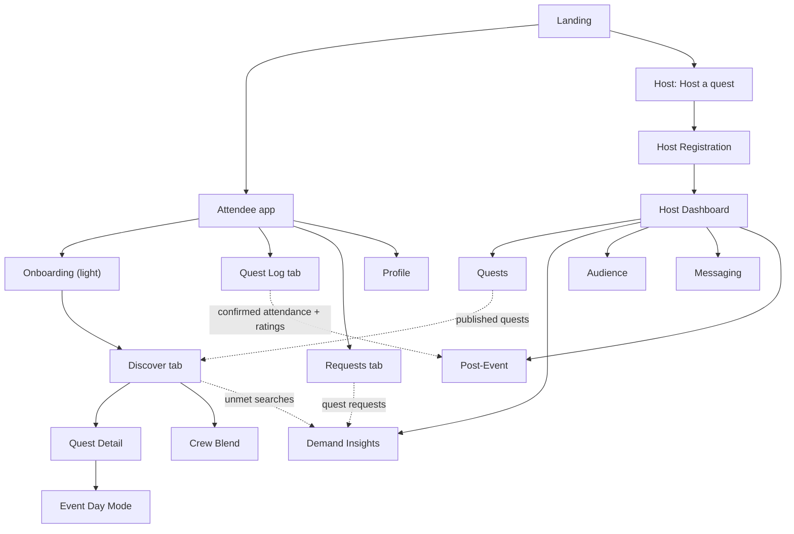
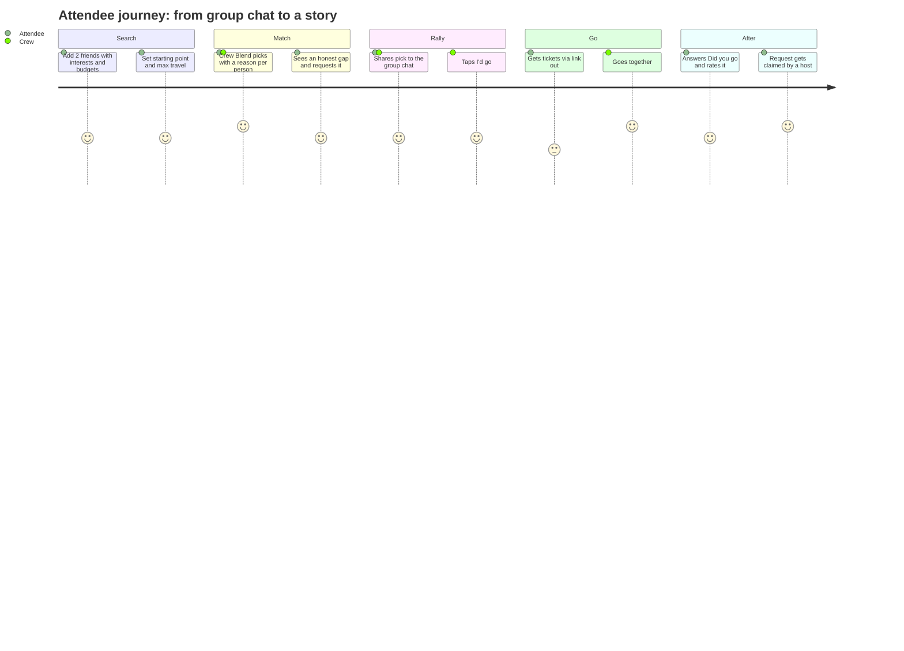
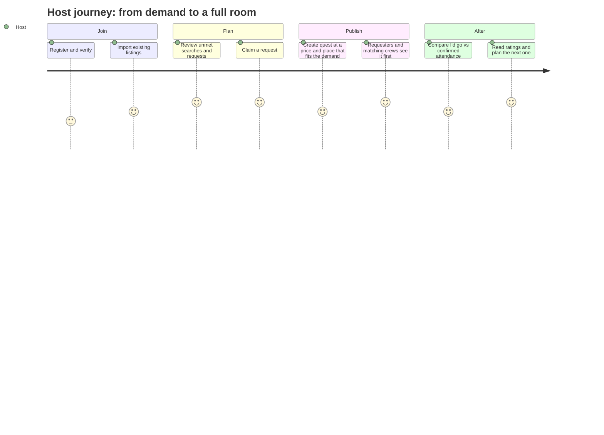
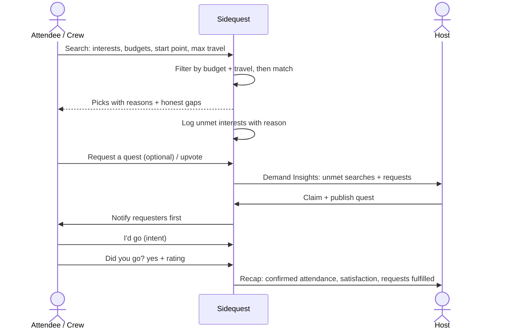

# Sidequest — Product Spec (Sidequest × Sketch 0)

> **Collect the stories, not just the tickets.**
> Primary CTA: **Find your quest** (solo or with your crew)

Sidequest is a local event discovery app for students and young professionals in downtown Toronto who want to find their scene and actually get their friends to come along. Tell it what you and your crew are into, what you'll spend and how far you'll travel, and it gives back matching events, each with a one-line reason. When nothing fits, that gap goes to hosts as a demand signal.

Positioning: *Toronto's events, tuned to you and your crew.* We launch with three scenes (music & nightlife, arts & making, active & social) and go deep on them rather than thin everywhere.

This spec merges the [Sidequest proposal](../SideQuest%20Proposal/Version-1.0/ProductSpecs.md) (the full product vision) with what [Sketch 0](README.md) built and learned (the working matcher and [strategy.md](strategy.md)). Where the two disagreed, Sketch 0's tested decisions win and the proposal's ideas are kept as later work.

_Last updated: October 2026 · Status: concept / draft · Sketch 0 column reflects the updated sketch_

---

## Table of Contents

1. [Overview](#1-overview)
2. [What changed from the proposal](#2-what-changed-from-the-proposal)
3. [Glossary](#3-glossary)
4. [Site Map](#4-site-map)
5. [Feature List](#5-feature-list)
6. [User Journeys](#6-user-journeys)
7. [Open Questions](#7-open-questions)

---

## 1. Overview

**Problem:** Event info is scattered across too many hubs. General tools (Google) are too broad, niche tools (EDMtrain) are too narrow, and nothing plans around your friends, your budget, or how you're getting there.

**User groups**

| Group | Who | Core need |
|---|---|---|
| Attendees | Students and young professionals downtown, solo or in a crew of up to 4 | Find events that fit everyone's taste, budget and travel, and get the group to actually go |
| Hosts | Venues, promoters, artists/collectives, community groups | Know what people want and couldn't find, and fill the room |

**Differentiators** (no competitor combines both)

- **Crew Blend** — picks that suit the whole group's tastes *and* budget, with a line per person on why. Never picked by chance.
- **Demand Signals** — what people searched for and couldn't find (and why: nothing listed, over budget, too far), plus explicit Quest Requests. Hosts see the aggregated demand and act on it.

**Competition:** mostly habit (Instagram, TikTok, group chats), plus Motivez (group plans picked by chance), Posh (personal feed only) and Spotify (concerts only). Fever and DICE are references.
**Partners, not rivals:** Eventbrite, Showpass and blogTO are where hosts already list events. We don't sell tickets; we link out.

**North star:** connecting people to like-minded people through worthwhile events in their area, measured by **events people confirm they attended** (not clicks, RSVPs or downloads) and **high satisfaction scores**.

It is a function of:

| Driver | What it means in the product |
|---|---|
| Match quality | The event fits their interests; for a crew, it fits everyone |
| Cost | It fits the budget. Free and low-cost come first when fit is similar |
| Getting there | Short trips, few transit transfers |
| Trust | Event and organizer reviews |
| Belonging | Seeing friends and others who are going |

**Matching rules** (from `strategy.md`)

- Budget and travel limits are hard filters applied *before* matching. Nothing over budget or too far is ever picked.
- A crew's budget is the lowest budget anyone set.
- For a crew, an event everyone would enjoy beats one person's perfect pick.
- Be honest: if nothing fits an interest, say so instead of stretching a weak match. That gap is a demand signal.

---

## 2. What changed from the proposal

| Topic | Sidequest proposal | Sketch 0 | Combined decision |
|---|---|---|---|
| Audience | Anyone in Toronto, built to scale | Students + young pros, downtown | Start narrow (downtown, students/young pros), scale later |
| Scope | All event types | Three scenes | Three scenes for launch |
| Positioning | "Spotify for local events" | "Tuned to you and your crew" | Crew-first; Spotify is a competitor, not the metaphor |
| Ticketing | Open question | Link out | **Decided:** link out (Eventbrite, Showpass, host site) |
| North star | Candidate metric | Confirmed attendance + satisfaction | **Decided:** confirmed attendance + satisfaction |
| Commitment | "Accept quest" = RSVP | "I'd go" is intent only; "Did you go?" confirms | Accepting is intent; only a confirmed "yes" counts |
| Demand Signals | Active requests only | Passive: unmet searches with reasons | Both: unmet searches feed in automatically, plus explicit Quest Requests |
| Budget & travel | Filters in search | Hard limits per person, transit minutes + transfers | Hard limits, set per person; shown on every pick |
| Taste profile | Persistent taste avatar from onboarding | Interests typed per search | Start per-search; avatar builds from confirmed, rated quests |
| Event data | Host-published | 23 fake samples | Host-supplied listings + partner feeds, not scraped from other platforms |

---

## 3. Glossary

Sidequest uses light gaming language in the UI. Plain terms are used in host-facing screens and analytics.

| Sidequest term | Plain meaning | In Sketch 0 |
|---|---|---|
| Quest | An event | Event card |
| Crew / Party | A friend group (up to 4 for Crew Blend) | "Who's going?" + Add friend |
| Crew Blend | Recommendations that fit everyone in the crew | Crew Blend picks |
| Accept quest | Intent to go (not attendance) | "I'd go" |
| Quest Log | Your plans: upcoming, saved, completed | Going tab |
| Quest complete | Confirmed attended, then rated | "Did you go?" → yes |
| Quest Request | An explicit ask for an event that doesn't exist yet | — |
| Unmet search | An interest nothing matched, with the reason | Demand Signals list |
| Demand Signals | Unmet searches + Quest Requests, aggregated for hosts | Hosts tab |
| Collected stories | Completed quests on your profile | — |
| Taste avatar | Profile that learns from what you confirm and rate | — |

---

## 4. Site Map

### High-level structure

The attendee app keeps Sketch 0's three-tab shape and grows each tab. Hosts get a separate dashboard.



### Full site map

```
Sidequest
├── Landing
│   ├── "Collect the stories, not just the tickets."
│   ├── [ Find your quest ]  → Attendee app
│   └── [ Host a quest ]     → Host registration
│
├── ATTENDEE  (bottom tabs: Discover · Quest Log · Requests)
│   ├── Onboarding (skippable; everything can be set per search)
│   │   ├── Pick your scenes (music & nightlife, arts & making, active & social)
│   │   ├── Usual budget
│   │   ├── Home base (starting station) + max travel time
│   │   └── Add your crew (contacts)
│   │
│   ├── Discover (Home)                                   ← Sketch 0
│   │   ├── Who's going? (you + up to 3 friends)
│   │   │   └── Per person: interests + budget
│   │   ├── Getting there: starting point + max travel time
│   │   ├── [ Find events ]
│   │   ├── Results
│   │   │   ├── Solo: picks with a one-line reason
│   │   │   ├── Crew Blend: picks + a line per person on why
│   │   │   ├── Each card: price, travel time + transfers, rating,
│   │   │   │              friends going, organizer
│   │   │   └── Honest gaps: "Nothing fit 'vegan food' (over budget)"
│   │   │       → [ Request this quest ]
│   │   ├── Later: For You feed, Tonight / This Weekend, map view
│   │   └── Share (copy / phone share sheet to group chat)
│   │
│   ├── Quest Detail (event page)
│   │   ├── Info, venue, price, date, scene
│   │   ├── Why this is for you (and for each crew member)
│   │   ├── Getting there (nearest stop, minutes, transfers)
│   │   ├── Reviews: event + organizer
│   │   ├── Friends and others going
│   │   └── I'd go · Share to crew · Get tickets (link out) · Follow host
│   │
│   ├── Quest Log (Going)                                 ← Sketch 0
│   │   ├── Upcoming ("I'd go" taps; intent only)
│   │   ├── After the event: "Did you go?"  yes / no
│   │   │   └── Yes → rate it → Quest complete (counts toward north star)
│   │   └── Completed (collected stories)
│   │
│   ├── Requests (Quest Requests)
│   │   ├── Request a quest ("I'd go to a ___ in ___ for under $__")
│   │   ├── Trending requests (upvote / join)
│   │   └── My requests + status (claimed by a host?)
│   │
│   ├── Crew (later: its own tab)
│   │   ├── Saved crews
│   │   ├── Group poll (which quest, when, meet-up spot)
│   │   └── Crew chat
│   │
│   ├── Event Day Mode (later)
│   │   ├── Entrances, venue info, accessibility
│   │   ├── Live host updates
│   │   └── Transit there + home
│   │
│   └── Profile
│       ├── Taste avatar (what it's learned; edit or remove)
│       ├── Collected stories
│       ├── Followed hosts
│       └── Settings & privacy (contacts, location, what friends see)
│
└── HOST
    ├── Registration
    │   ├── Host type: Venue · Promoter · Artist/Collective · Community group
    │   ├── Host profile (logo, bio, scenes, neighbourhoods, socials)
    │   ├── Verification (org info, socials, past events, venue + capacity)
    │   └── Ticketing link (Eventbrite, Showpass, own site)
    │
    ├── Dashboard
    │   ├── Upcoming quests
    │   ├── Snapshot: "I'd go" vs. confirmed attendance per quest   ← Sketch 0
    │   └── New demand matching your scene + area
    │
    ├── Quests
    │   ├── Create: title, date, scene, tags, price, venue, nearest stop,
    │   │           description, ticket link, event-day info
    │   ├── Drafts · Live · Past
    │   └── Import from partner listing (Eventbrite / Showpass / blogTO)
    │
    ├── Demand Insights                                   ← Sketch 0 (Hosts tab)
    │   ├── Unmet searches: interest, reason (nothing listed / over budget
    │   │                   / too far), budgets, starting points
    │   ├── Quest Requests + upvotes
    │   ├── Filter by scene, area, date, crew size, budget
    │   └── Claim ("We're on it") → requesters notified first
    │
    ├── Audience
    │   ├── Followers
    │   └── Aggregated, anonymized taste + budget segments
    │
    ├── Messaging
    │   └── Announcements + event-day updates to followers / interested
    │
    └── Post-Event
        ├── Confirmed attendance + satisfaction ratings
        └── Requests fulfilled
```

---

## 5. Feature List

**Priority key:** `MVP` = needed for first release · `Diff` = key differentiator · `Later` = post-MVP
**Sketch 0 column:** ✅ built · ◐ partly built / faked · — not built

### Attendee features

| # | Area | Feature | Description | Priority | Sketch 0 |
|---|---|---|---|---|---|
| A1 | Discovery | Interest + budget per person | Say what you're into and what you'll spend | MVP | ✅ |
| A2 | Discovery | Travel limit | Starting point + max travel time; filters before matching | MVP | ◐ 4 fixed stations |
| A3 | Discovery | AI match with reasons | One-line reason per pick; only eligible events can be picked | MVP | ✅ |
| A4 | Social | **Crew Blend** | Up to 4 people; fits everyone; lowest budget wins; line per person | Diff | ✅ |
| A5 | Discovery | Honest gaps | Says when nothing fits, and why | Diff | ✅ |
| A6 | Discovery | Event card trust signals | Price, transit time + transfers, event + organizer reviews | MVP | ◐ fake data |
| A7 | Social | Friends going | See which friends and others are going | MVP | ◐ fake data |
| A8 | Social | Share to group chat | Copy or phone share sheet | MVP | ✅ |
| A9 | Plans | "I'd go" (Accept quest) | Save intent; feeds Quest Log | MVP | ✅ browser only |
| A10 | Plans | "Did you go?" | Confirms attendance after the event | MVP | ✅ |
| A11 | Feedback | Rate a quest | Satisfaction score; trains the taste avatar | MVP | ◐ rating, no avatar |
| A12 | Demand | **Request a quest** | Turn an honest gap or idea into a request; upvote others | Diff | ✅ |
| A13 | Demand | Request notifications | First notice when a host claims your request | Diff | ◐ in-app only |
| A14 | Control | Correct or reject a match | "Not for me" / "Not for Sam" feedback on picks | MVP | ◐ logged, not learned |
| A15 | Social | Separate starting points | Each crew member travels from their own place | MVP | ✅ |
| A16 | Personalization | Taste avatar | Learns from confirmed, rated quests; viewable and editable | Later | — |
| A17 | Discovery | For You feed, map, Tonight / Weekend | Browse without searching | Later | — |
| A18 | Social | Saved crews, polls, crew chat | Plan inside the app instead of the group chat | Later | — |
| A19 | Event day | Event Day Mode | Entrances, live updates, transit home | Later | — |
| A20 | Profile | Collected stories | Visual history of completed quests | Later | — |
| A21 | Profile | Follow hosts | Updates from favourite hosts | Later | — |

### Host features

| # | Area | Feature | Description | Priority | Sketch 0 |
|---|---|---|---|---|---|
| H1 | Demand | **Unmet searches** | Interests nobody could match, with reason, budgets, starting points | Diff | ✅ |
| H2 | Demand | Merge similar requests | Group "vegan food" and "vegan" into one signal | Diff | ✅ |
| H3 | Demand | **Quest Requests + claim** | See explicit requests; claim one; requesters notified first | Diff | ✅ |
| H4 | Demand | Demand filters / heatmap | By scene, area, date, crew size, budget | Later | — |
| H5 | Insights | Interest vs. attendance | "I'd go" next to confirmed attendance per event | MVP | ✅ |
| H6 | Registration | Host type, profile, verification | Keeps listings trustworthy | MVP | — |
| H7 | Events | Create / publish quest | Details, scene, tags, price, venue, nearest stop, ticket link | MVP | — |
| H8 | Events | Partner import | Pull an existing Eventbrite / Showpass listing | MVP | — |
| H9 | Post-event | Ratings + recap | Satisfaction, confirmed attendance, requests fulfilled | MVP | ◐ no recap |
| H10 | Messaging | Announcements + live updates | Reach followers and interested attendees | Later | — |
| H11 | Audience | Followers + segments | Aggregated, anonymized | Later | — |
| H12 | Event day | Check-in + headcount | Door tools | Later | — |

---

## 6. User Journeys

### 6.1 Attendee journey (with a crew)



| Stage | What they do | Touchpoint | Problem solved |
|---|---|---|---|
| 1. Search | Adds two friends, each with interests and a budget; picks Union, 30 min max | Discover | Group chats stall on "idk what do you guys want" |
| 2. Match | Gets three picks that fit everyone, under the lowest budget, with a line per person | Crew Blend results | Info overload; one person's pick leaves others out |
| 3. Gap | Sees "Nothing fit 'pottery' within $20" and taps Request this quest | Honest gap → Requests | Niche interests go unmet silently |
| 4. Rally | Shares the top pick to the group chat; everyone taps I'd go | Share · Quest Log | Plans fall through without a decision point |
| 5. Go | Follows the ticket link; uses the transit info to get there | Quest Detail (link out) | Hidden costs and long trips kill plans |
| 6. Confirm | Answers "Did you go?" and rates the night | Quest Log | Clicks and RSVPs don't show what really happened |
| 7. Loop closes | A host claims the pottery request; requesters hear first | Notification | Attendees feel unheard |

### 6.2 Host journey



| Stage | What they do | Touchpoint | Problem solved |
|---|---|---|---|
| 1. Join | Registers, verifies, imports listings from Eventbrite or Showpass | Host Registration | No double entry; keeps quality high |
| 2. Plan | Sees "12 people wanted beginner pottery, most under $25, starting near Kennedy" | Demand Insights | Hosts guess at what people want |
| 3. Claim | Claims the request cluster ("We're on it") | Demand Insights | No direct line to what their audience wants |
| 4. Publish | Prices and places the quest to fit the signal | Quests → Create | Events land at the wrong price or place |
| 5. Fill | Quest is matched to fitting people and crews; requesters notified first | Discover + notifications | Paid promotion reaches the wrong people |
| 6. Learn | Sees 40 "I'd go", 28 confirmed attended, 4.6 rating | Post-Event | Interest numbers overstate real turnout |

### 6.3 The Demand Signal loop



---

## 7. Open Questions

Items below are proposals for team discussion, not final decisions.

**Resolved by Sketch 0 / strategy**

- [x] **Ticketing:** link out; we don't sell tickets.
- [x] **North star:** confirmed attendance + satisfaction, not clicks or RSVPs.
- [x] **Launch scope:** downtown Toronto, three scenes.

**Still open**

- [ ] **Event data (Week 5):** which host-supplied and partner sources can we actually get, and how fresh are they?
- [ ] **Human control (Weeks 4, 8):** how do people correct or reject a match, and how much does the AI explain itself?
- [ ] **Bad AI picks (Weeks 6, 9):** what happens when the AI picks badly or invents something, beyond restricting it to eligible events?
- [ ] **Confirming attendance:** "Did you go?" only after the event? Any lightweight proof (check-in, host confirmation)?
- [ ] **Separate starting points:** how should Crew Blend weigh travel when friends start from different places?
- [ ] **Demand Signal quality:** how to merge similar wording and filter noise before hosts see it.
- [ ] **Gaming language:** keep "quest" in the UI, or test against plain terms with the target audience?
- [ ] **Privacy:** what friends see (plans, requests, attendance), and what hosts see (aggregated only?).
- [ ] **Taste avatar:** worth building, or is per-search input plus ratings enough?
